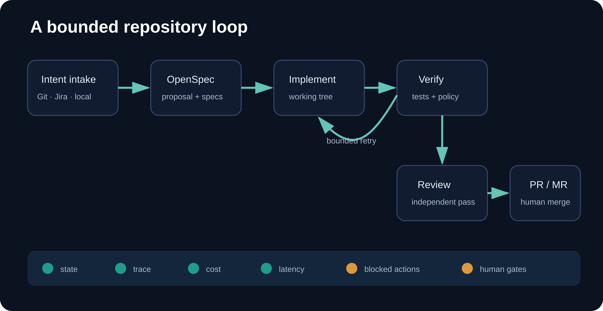
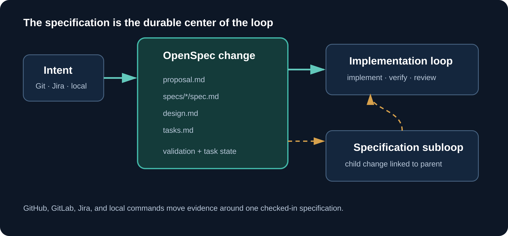
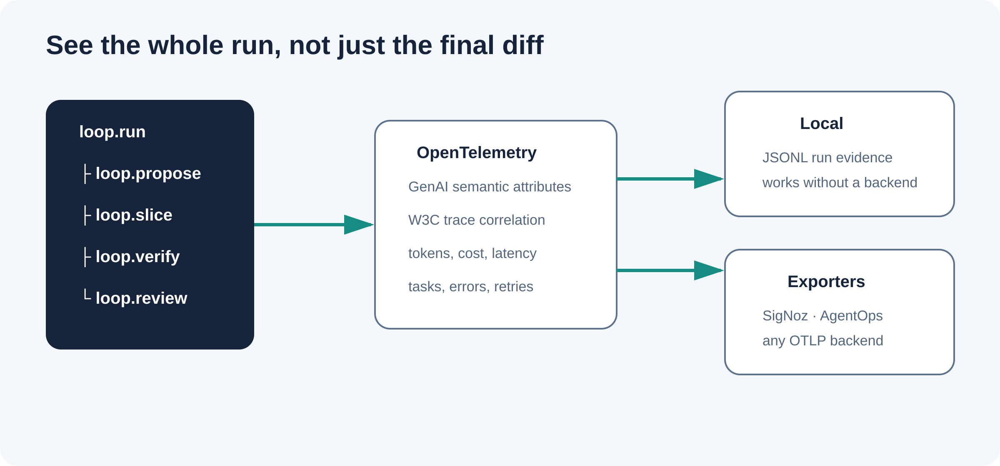

# agentic-loop-bundle

Install a specification-first, bounded, observable coding-agent loop into an
existing GitHub or GitLab repository.

The bundle turns reviewed intent into an OpenSpec proposal, behavioral
specifications, small implementation slices, cumulative verification,
independent review, and a pull or merge request. Jira can mirror the work and
evidence without becoming a second technical source of truth.





## Quick start

Run from the repository you want to configure:

```bash
# GitHub
curl -fsSL https://raw.githubusercontent.com/mwigge/agentic-loop-bundle/main/install.sh \
  | bash -s -- --github --with-signoz --install-deps

# GitLab
curl -fsSL https://raw.githubusercontent.com/mwigge/agentic-loop-bundle/main/install.sh \
  | bash -s -- --gitlab --with-signoz --install-deps
```

Check the setup:

```bash
./loopctl doctor
./loopctl telemetry-test
```

The installer is idempotent and conservative. Changed managed files stop
installation unless `--force` is supplied; replaced files are backed up beneath
`.agentic-loop/backups/`.

## What gets installed

| Path | Purpose |
|---|---|
| `.agentic-loop/loop.json` | Retry, timeout, review, OpenSpec, and telemetry policy |
| `.agentic-loop/prompts/` | Proposer, implementer, and reviewer contracts |
| `.agentic-loop/bin/` | Loop runtime, quality gate, verifier, and Docker smoke runner |
| `.agentic-loop/docker/` | Repository-customizable smoke-test image |
| `loopctl` | Repository-local command |
| `.github/` | GitHub issue template and Actions workflow |
| `.gitlab-ci.agentic-loop.yml` | GitLab loop job |
| `.agentic-loop/observability/signoz/` | Optional standalone SigNoz setup |

OpenSpec changes are checked-in content under `openspec/changes/`. Runtime
evidence is private local state under `.agentic-loop/runs/` and is ignored by
Git.

## Runner requirements

Use a dedicated self-hosted runner labeled or tagged `agentic-loop` with:

- Python 3.10 or newer;
- Node.js 20 or newer;
- Docker with Compose;
- Git;
- Codex, Claude Code, or OpenCode;
- the repository's normal build and test tools.

`--install-deps` installs OpenSpec `1.4.1` repository-locally and the optional
OpenTelemetry and AgentOps Python packages.

The runtime detects Codex, Claude Code, then OpenCode. Override the agent command
when required:

```bash
export LOOP_AGENT_COMMAND='codex exec --full-auto -'
```

## OpenSpec is the work envelope

Free-form implementation runs are not accepted. First create an apply-ready
OpenSpec change:

```bash
./loopctl propose \
  --change add-parser-guard \
  --task "Reject malformed parser input and cover the behavior with tests"

./loopctl run --change add-parser-guard
```

The proposal stage creates and validates:

- `proposal.md`: intent, scope, and impact;
- `specs/*/spec.md`: requirements and scenarios;
- `design.md`: target architecture, shared contracts, migration path, and final acceptance;
- `tasks.md`: ordered, independently verifiable implementation slices.

Large work can create a linked specification subloop:

```bash
./loopctl propose \
  --change add-parser-fuzzing \
  --parent-change add-parser-guard \
  --task "Specify and add bounded parser fuzz testing"
```

The parent relationship is recorded in metadata and telemetry.

## Slice-by-slice without tunnel vision

The runtime selects one unchecked OpenSpec task at a time. Every slice receives
the complete proposal, all specs, the design, the full task graph, prior work,
and the cumulative working-tree diff.

Before changing code, the implementer must explain how the slice advances the
target architecture and which later tasks depend on its contracts. A slice only
advances when:

1. Its test is added or changed first.
2. The smallest cohesive implementation is made.
3. Formatting, import sorting, linting, and tests pass.
4. The complete working tree passes in a disposable Docker container.
5. The OpenSpec task is marked complete.

Verification is cumulative. The loop does not test a slice in isolation and
does not allow locally convenient interfaces that contradict the final design.

## Required engineering policy

The generated gate enforces:

- TDD evidence for source changes;
- SOLID design and cohesive, readable code through proposer and review contracts;
- project linting, formatting, import sorting, type checks, and tests where detected;
- a Docker smoke build and run after every task slice;
- independent review against the full OpenSpec end state;
- no AI attribution, generated-by notices, model names, or AI co-author lines.

Customize `.agentic-loop/docker/Dockerfile` with the project's compilers,
services, and dependency installation. Extend
`.agentic-loop/bin/verify.sh` for repository-specific checks. These policy files
are hashed before implementation; an agent cannot weaken them during a run.

## GitHub workflow

1. Install with `--github --configure-remote`.
2. Register a self-hosted runner labeled `agentic-loop`.
3. Add model credentials as Actions secrets.
4. Create an **Agent loop task** issue.
5. A trusted maintainer applies `agent:ready`.

The workflow authorizes the trigger, creates `openspec/changes/issue-<number>`,
runs all verified slices on an `agent/issue-*` branch, and opens a pull request.
It never merges or pushes to the default branch.

## GitLab workflow

If `.gitlab-ci.yml` already exists, include:

```yaml
include:
  - local: .gitlab-ci.agentic-loop.yml
```

Register a runner tagged `agentic-loop`, add a protected `GITLAB_TOKEN`, and
start a manual, scheduled, or API pipeline with:

```text
LOOP_ISSUE_IID=123
```

The job creates `openspec/changes/issue-123`, runs the bounded slices, and opens
a merge request.

## Jira synchronization

Jira is optional but first-class for documenting loop work. OpenSpec remains the
checked-in technical authority.

Configure:

```bash
export JIRA_BASE_URL="https://example.atlassian.net"
export JIRA_EMAIL="developer@example.com"
export JIRA_API_TOKEN="..."
```

Link a loop:

```bash
./loopctl propose --change add-parser-guard --jira ENG-123
./loopctl run --change add-parser-guard --jira ENG-123
```

When no `--task` is supplied, the proposal fetches the Jira summary and
description as intake. The loop comments proposal readiness, run start, success
or failure, and the final PR/MR URL. GitHub workflow dispatch accepts
`jira_issue`; GitLab accepts `LOOP_JIRA_ISSUE`.

## Observability



Every run writes private JSONL evidence. With telemetry dependencies installed,
it also emits GenAI OpenTelemetry spans:

```text
loop.propose
loop.run
├── loop.slice.start
├── gen_ai.client.operation
├── loop.verify
├── loop.slice.complete
├── loop.retry
└── gen_ai.client.operation  (review)
```

Attributes correlate repository, platform, OpenSpec change, parent change, Jira
issue, Git issue, commit, task slice, attempt, model system, status, and
duration. Prompt and response bodies are not exported.

Set `AGENTOPS_API_KEY` for optional AgentOps session outcomes. OpenTelemetry
remains the canonical signal.

### Standalone SigNoz

```bash
./.agentic-loop/observability/signoz/signoz.sh up
export OTEL_EXPORTER_OTLP_ENDPOINT=http://localhost:4318
./loopctl telemetry-test
```

Open `http://localhost:8080`. Suggested panels are documented in
[`dashboards/signoz-queries.md`](dashboards/signoz-queries.md).

## Safety

- Trusted maintainers start repository loops.
- Work stays on review branches with human merge gates.
- Attempts, task slices, and execution time are bounded.
- OpenSpec and verification policy are protected from agent edits.
- Docker smoke tests use the cumulative working tree.
- Concurrent work on one issue is prevented.
- Telemetry excludes prompt and response content by default.
- Dedicated runners and credentials should have minimal permissions.

Do not expose an agent-enabled self-hosted runner to untrusted pull-request
workflows.

## Development

```bash
make verify
```

The suite checks both installers, idempotency, conflicts, proposal-first
execution, multi-slice progress, policy tamper rejection, OpenSpec compatibility,
and local telemetry.

## License

Apache License 2.0.
