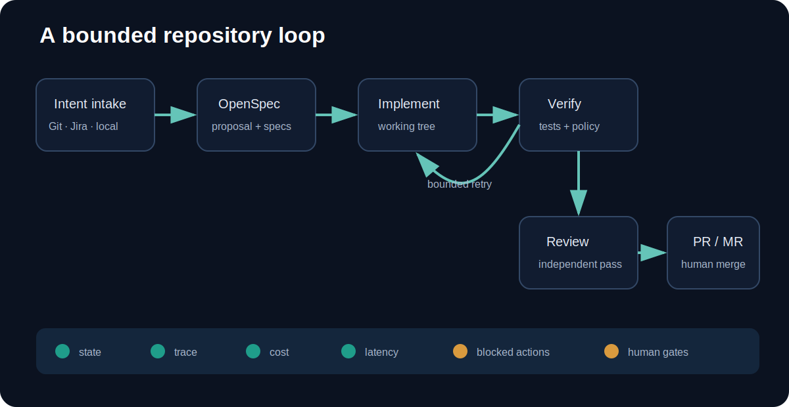
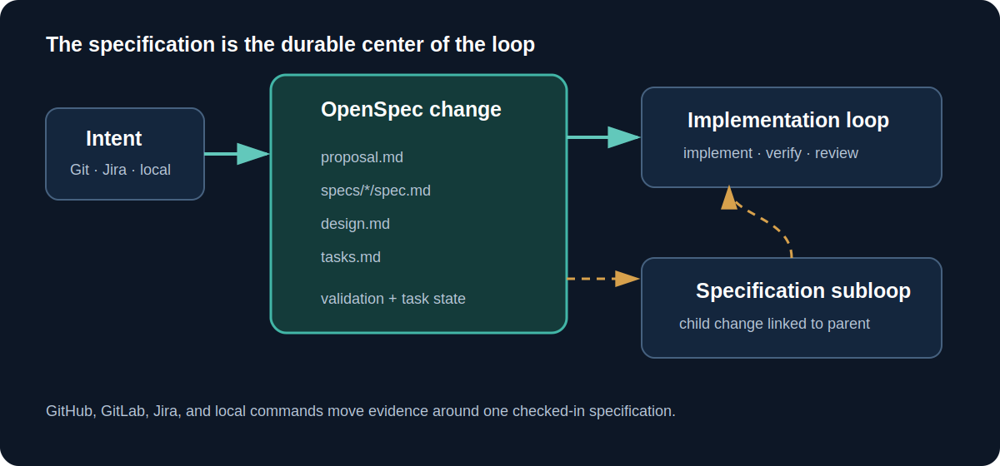
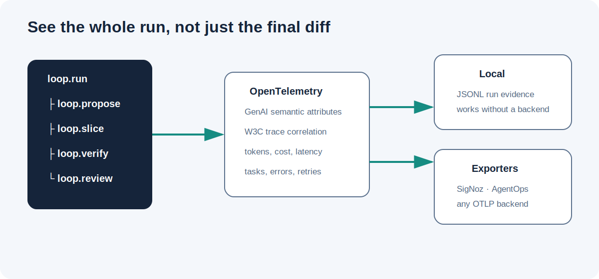
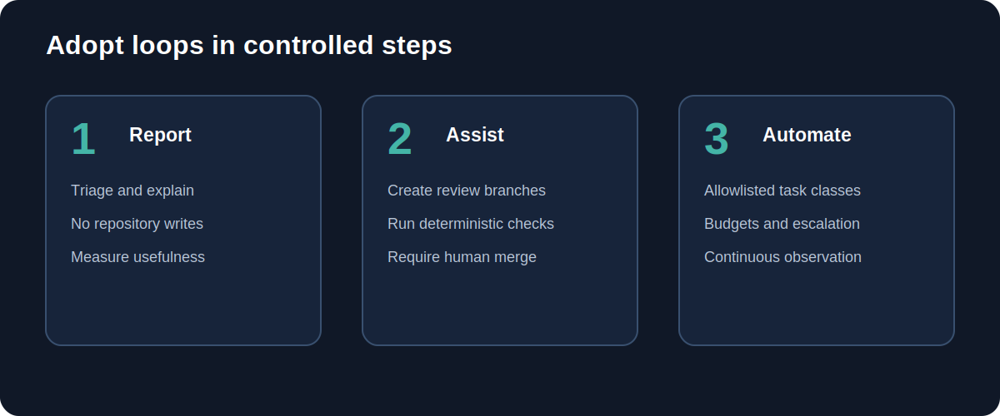

# From agent prompts to engineering loops

A coding-agent session is useful, but it is a weak unit of engineering. It
mixes intent, design, implementation, and review in one temporary conversation.
It can also sound finished without producing the evidence a repository needs.

An engineering loop changes the unit of work. The team defines the
specification, task graph, quality gates, evidence, limits, and human handoff.
The agent operates inside that system.

## Start with a durable specification

This bundle requires an OpenSpec change before implementation.

The proposal records why the change exists. Behavioral specifications define
requirements and scenarios. The design describes the target architecture,
shared contracts, compatibility constraints, and migration path. Tasks divide
that end state into independently verifiable slices.

This is more than planning paperwork. Every implementation and review stage
receives the same complete artifact set. A task cannot quietly redefine an
interface because its local implementation is easier.

When a large change contains a decision that needs separate exploration, it can
create a linked specification subloop. The child has its own artifacts, trace,
and review while remaining connected to the parent end state.

## Small slices, holistic decisions

Small slices provide earlier feedback, but isolation is dangerous. A sequence
of locally reasonable changes can still produce duplicated abstractions,
incompatible interfaces, or a migration dead end.

The loop therefore combines two rules:

1. Implement and verify one OpenSpec task at a time.
2. Evaluate every task against the complete specification, design, task graph,
   prior diff, and final acceptance criteria.

Before a slice starts, the agent identifies the shared contracts it touches and
the later work that depends on them. After the slice, the complete working tree
is verified again. Progress is incremental; architectural context is not.

## Evidence instead of confidence

Completion is supported by:

- a validated OpenSpec proposal, specs, design, and tasks;
- a bounded sequence of task slices and retries;
- TDD evidence for production changes;
- cumulative lint, format, import-sort, test, and policy results;
- a fresh Docker smoke environment for every slice;
- an independent review against the end-state design;
- correlated traces and durable local evidence;
- a human merge decision.

No single item proves perfection. Together, they make the process inspectable,
repeatable, and improvable.

## Why Docker smoke tests happen early

A local environment can hide missing dependencies, undeclared services,
incorrect paths, and state left behind by earlier commands. Waiting until the
end to discover those failures makes every later task depend on a false
assumption.

The generated verifier builds a repository-defined Docker image after each
slice, mounts the cumulative working tree, and runs the full verifier inside a
disposable container. Teams extend that image with their actual compiler,
package manager, database clients, and supporting services.

The objective is not to replace deeper CI environments. It is to catch
environment and integration failures while the responsible slice is still
small.

## Engineering rules belong in the harness

Requests such as “use TDD” or “write clean code” are too easy to lose in a long
session. The bundle puts them in multiple layers:

- OpenSpec tasks require tests and explicit verification.
- The quality gate rejects source changes without changed tests.
- Detected formatters, linters, import sorters, and test runners execute.
- Proposer and reviewer contracts enforce SOLID design, cohesion, and clarity.
- Policy files are hashed so the implementation agent cannot weaken them.
- Added AI attribution and AI co-author text is rejected.

The automated checks cover what can be measured. The specification and review
contracts cover architectural quality that requires judgment.

## Observability is part of correctness

Without telemetry, an agent loop looks like a slow CI job that sometimes
produces code. Important questions remain hidden:

- Which OpenSpec task was active?
- Which stage consumed the time?
- Did implementation fail or did verification reject it?
- Did Docker expose an environment problem?
- How many retries were required?
- Did a subloop drift from its parent design?

The bundle records proposal, run, slice, model, verification, retry, outcome,
repository, Jira, and parent-change correlations. JSONL evidence always works
locally. OpenTelemetry can feed the included SigNoz developer stack or another
OTLP backend. AgentOps can receive optional session outcomes.

Prompts, responses, and source content are excluded from telemetry by default.

## Git systems execute; Jira communicates

GitHub and GitLab provide repository events, protected branches, runners, and
review requests. Jira provides planning and stakeholder visibility. OpenSpec
provides the versioned technical contract.

The loop can comment on a Jira issue when a proposal is ready, when work starts,
when it succeeds or fails, and when a PR or MR is available. That keeps project
work visible without duplicating requirements across systems.

## Human gates are normal loop states

Human review is not evidence that automation failed. Product judgment,
security-sensitive decisions, and architecture tradeoffs belong at explicit
gates.

The generated workflows require a trusted trigger, isolate changes on a branch,
and stop at a pull or merge request. The framework removes repetitive
orchestration; it does not take merge authority away from the team.

## Adopt in controlled steps

Start with report-only tasks. Move to review branches for narrow work with a
strong verifier. Consider more automation only for task classes with stable
specifications, low permissions, clear rollback, observed failure patterns, and
acceptable cost.

Measure successful slices, retries, verification failures, Docker failures,
human rework, latency, cost, and security incidents. The useful question is not
whether agents are generally productive. It is whether a specific loop moves a
specific class of work through the repository with acceptable evidence and
review effort.

The end goal is not autonomous activity. It is a disciplined, observable
engineering process that can use agents without giving up specifications,
quality, architecture, or accountability.
